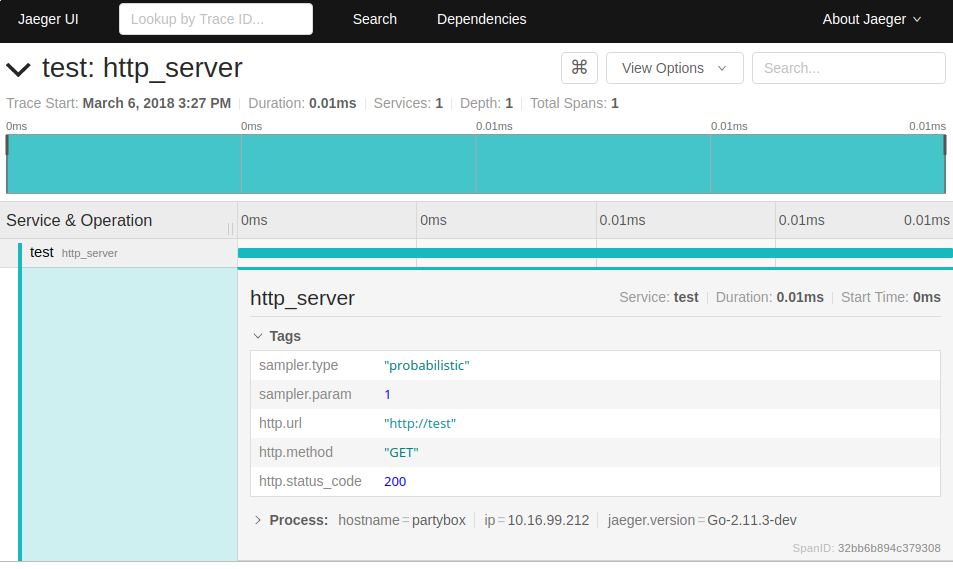

# Important Changes

## Versioning

### 11-March-2019 SHA ae6dd1a5888c9ebcd70bdf45bd87eb1ba9adf445
* Tracing public constants are moved to the sub package `tracing/defs`

### 19-February-2019 SHA 059dfccaccf3b48d5745f793a41fb45dcd68c8e7
* Tracing options now requires a `sampler` in the [configuration](#configuration)
* Tracers are loaded with values from environmental variables when available

### 7-February-2019 SHA 1a95ec4ccdbcd6a47377102231a3a745bab3a645
* Uber Opentracing Header is now used to track our spans, as our uuids are incompatible with jaeger.

# tracing

[hurley Tracing Configuration](https://wiki.hbo.com/pages/viewpage.action?spaceKey=HUR&title=Tracing+Configuration+Guide)

The `tracing` package provides an HTTP middleware ensures that each incoming
HTTP request that doesn't already have trace/span information in [Zipkin-style
`X-B3-*` headers](https://github.com/openzipkin/b3-propagation) are supplied
with it.

If such information is not present, a new pseudo-random traceID and spanID will
be created for the request, and the values copied into both the response's HTTP
headers and the current request's context, for use by other middleware/handlers.

It also accepts a new `uber-trace-id` header per the [jaeger definition](https://www.jaegertracing.io/docs/1.6/client-libraries/#propagation-format)
this ensures that the open tracing library is able to report on traces created
using the `uber-trace-id`.

## Running Jaeger Locally
1.
```
$ docker run -d --name jaeger \
  -e COLLECTOR_ZIPKIN_HTTP_PORT=9411 \
  -p 5775:5775/udp \
  -p 6831:6831/udp \
  -p 6832:6832/udp \
  -p 5778:5778 \
  -p 16686:16686 \
  -p 14268:14268 \
  -p 9411:9411 \
  jaegertracing/all-in-one:1.8
```
2.
[Local Jaeger UI](http://localhost:16686)

[reference docs](https://www.jaegertracing.io/docs/1.8/getting-started/)

### Details
The [opentracing documentation](http://opentracing.io/documentation/) does a
fantastic job of explaining the basic tracing concepts and terminology, and is
a very worthwhile read for obtaining the necessary background/context for this
tracing effort.

The [hurley sampling documentation](https://docs.google.com/document/d/1lDcelswn96oN0rW57rHHrYG2FX6GNmkVUWy-YEJwciI/edit?usp=sharing) for our tracing efforts outlines the
type of tracer used, known issues, as well as provides an overview of the tracing platform.


#### Uber Trace ID

Jaeger traces are strictly `unint64`s which make them incompatible with hurley UUID style tracing. In order
to ensure we have traces sent to jaeger and we still maintain our UUID logging, we use the uber-trace-id.
In an over view, the `uber-trace-id` looks like `da96f2b6052f6c19:528a1dadbb65c980:514647a03e5a0f35:11` where
the first element is the traceID, the second a spanID, the third a parentID (which is 0 or blank for the root) and
the last are flags. On an incoming request if a `uber-trace-id` is present, it uses the details from the header
to tie the traces together, using the previous span as the parent span. If no `uber-trace-id` is present, one will be
created by the underlying libraries.

This `uber-trace-id` should be forwarded on all outbound requests, along with the `X-B3-*` headers
which we sill use for logging

#### Middleware

When the new middleware is added to a service, a tracer is created to collect
information about incoming HTTP requests.

The middleware automatically creates a new span object for every incoming HTTP
request, and tags the span with:

- the request URL
- the request HTTP method
- the status code

An example trace can be seen (using the Jaeger UI):



### Configuration

The provided `Options` struct should be used to unmarshal config settings from
a JSON config file, and used to configure/instantiate the tracing middleware.

This way, all services end up having a standard, consistent, easy-to-find
config section for configuring all aspects of tracing.  Such a config section
looks like:

```
{
  "tracing": {
    "sampler": {
      "type": "probablistic",
      "param": 0.01
    },
    "reporter": {
      "agentHost": "localhost",
      "agentPort": 6381
    },
    "disabled": false
  }
}
```

### Usage

The current recommended configuration is:
```
{
  "tracing": {
    "sampler": {
      "type": "remote",
      "param": 0.01
    },
    "disabled": false
  }
}
```

In your `main` method, or wherever you do your service startup/initialization,
you'll likely have code that looks like:

```
// create the tracer
tracer, closer, err := CreateTracer(config.ServiceName, opts)

// don't forget to close the tracer when the service/process exits, in order to
// drain any buffered tracing data
defer closer.Close()

// configure the "global singleton" tracer with opentracing.  This makes the
// tracer MUCH easier to access and use later on, and in far-flung parts of the
// codebase.
opentracing.SetGlobalTracer(tracer)


// create a middleware to use to instrument incoming HTTP requests
middleware, err := NewTracerMiddleware(next, UseTracer(tracer))

```

If you want to access the current traceID/spanID, you can retrieve them from the requests's context:

```
traceID, spanID, _ := tracing.InfoFromContext(req.Context())
```

If you want to create a new "child" span, for instrumenting things like:
- outgoing HTTP requests
- database accesses
- cache operations
- anything else you want to be part of the trace

you can use the convenient `StartSpanFromContext` method:

```
// create a span for accessing a DB
childSpan := opentracing.StartSpanFromContext(req.Context(), "db_query")
childSpan.SetTag("foo", "bar")
childSpan.Finish() // don't forget to finish the span!

childSpan := opentracing.StartSpanFromContext(req.Context(), "some_other_operation")
...
```

Of course, the full `opentracing` API is available for you to use as well.  See
[the opentracing package's
documentation](https://github.com/opentracing/opentracing-go) for full details.

### Options
The tracer can be configured with several behaviors (most of them
optional), using various configuration functions supplied by the `tracing`
package:

#### Agent host/port
The host and port of the Jaeger agent that collects all the tracing data from
the services can be specified using the `AgentAddress` configuration function,
the following config will set the value for you.
**NOTE**: This value is overwritten by the [JAEGER environment variables](https://www.jaegertracing.io/docs/1.9/client-features/)

```
{
  "tracing": {
    "reporter": {
      "agentHost": "localhost",
      "agentPort": 6381
    },
    "disabled": false
  }
}
```

#### Sampling
The `SampleRate` and `SamplerType` function can be used to make the tracer sample _X%_ of all
traces.  By default, the tracer is configured to collect 1% of traces.
**NOTE**: This value is overwritten by the [JAEGER environment variables](https://www.jaegertracing.io/docs/1.9/client-features/)

```
{
  "tracing": {
    "sampler": {
      "type": "probablistic",
      "param": 0.01
    },
    "disabled": false
  }
}
```


#### Example:
If the HTTP server at `https://foobar.com` is using this middleware, then `curl
-v https://foobar` would return something similar to:

```
< HTTP/1.1 200 OK
< Content-Type: text/plain; charset=utf-8
< Date: Wed, 21 Feb 2018 21:18:10 GMT
< X-B3-Spanid: 33292b64fe21c0cc
< X-B3-Traceid: 33292b64fe21c0cc
< Content-Length: 37
< Connection: keep-alive
```

Additionally, the traceID/spanID values will be added to the current request's
context, where they can be accessed like so:
```
traceID, spanID, _ = TracingInfoFromContext(req.Context())
```

### Dependencies

[Jaeger](https://github.com/jaegertracing/jaeger) is used to collect all
tracing information.  Jaeger's Go client is wrapped by this package, and can be
installed locally with:

    go get -u -v github.com/uber/jaeger-client-go

### Known Issues

https://github.com/jaegertracing/jaeger-client-go/issues/177
